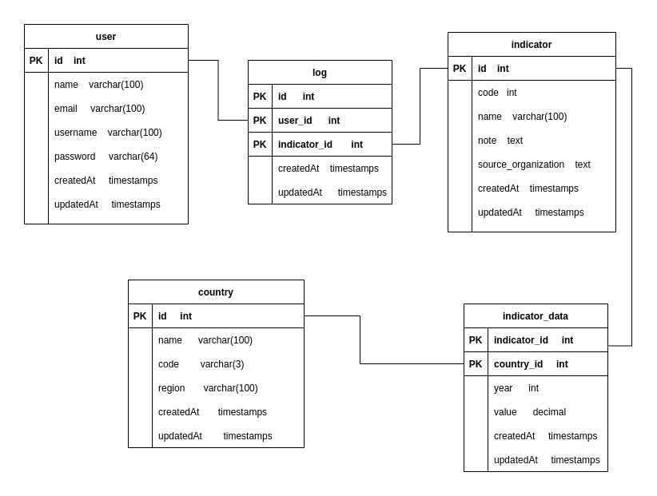

# Banco de dados

## Diagrama

### country
- id              int
- name            varchar(100)
- code            varchar(3)
- region          varchar(100)
- created_at      timestamps
- updated_at      timestamps

### indicator
- id                    int
- code                  varchar(10)
- name                  varchar(100)
- note                  text
- source_organization   text
- created_at            timestamps
- updated_at            timestamps

### indicator_data
- country_id      int
- indicator_id    int
- year            int
- value           int
- created_at      timestamps
- updated_at      timestamps

### user
- id              int
- name            varchar(100)
- email           varchar(100)
- username        varchar(100)
- password        varchar(64)
- created_at      timestamps
- updated_at      timestamps

### log
- id            int
- user_id       int
- indicator_id  int
- created_at    timestamps
- updated_at    timestamps

